# Sistema Bancario Distribuido

Implementamos un banco central con Laravel, una sucursal con Laravel y un cajero automático con Express.js. Cada aplicación tiene su propio proceso y configuración. Utilizamos dos proyectos Supabase para separar los saldos e historial del banco de los registros operativos de los nodos.

> [!NOTE]
> **Prueba de integración:** abrimos una cuenta con **$1,000.00**, retiramos **$300.00** y comprobamos **$700.00** en el banco central. Después documentamos operaciones del ATM publicado en Vercel.

**Contenido:** [Equipo](#integrantes-y-perfiles-de-github) · [Aplicaciones](#aplicaciones-publicadas) · [Arquitectura](#arquitectura-del-sistema) · [Implementación](#implementación-de-los-nodos) · [Datos y seguridad](#datos-y-seguridad-en-supabase) · [Prueba integrada](#prueba-de-integración) · [Despliegue](#despliegue-y-vinculación-con-git) · [OpenAPI](#contratos-openapi-y-organización-del-código) · [Instalación](#configuración-y-ejecución-local) · [Montar la infraestructura](#cómo-montar-toda-la-infraestructura) · [Problemas frecuentes](#solución-de-problemas-frecuentes) · [Pruebas](#verificación-y-pruebas)

---

## Integrantes y perfiles de GitHub

| Andrés Monjaras | Omar | Dennis |
|---|---|---|
| [](https://github.com/AndresMonjaras) | [](https://github.com/omarsyn) | [](https://github.com/DennisQuintanaL) |
| [@AndresMonjaras](https://github.com/AndresMonjaras) | [@omarsyn](https://github.com/omarsyn) | [@DennisQuintanaL](https://github.com/DennisQuintanaL) |
| Banco central | Sucursal | Cajero automático |

*Tabla 1. Integrantes, perfiles y responsabilidad de cada nodo. Fuente: elaboración propia del equipo.*

Colaboramos en el repositorio [sistema_bancario_distribuido](https://github.com/AndresMonjaras/sistema_bancario_distribuido). Conservamos las referencias al [commit de Omar](https://github.com/AndresMonjaras/sistema_bancario_distribuido/commit/96d4c226992b5b22544c5830647a2e25d050dd74), al [commit de Dennis](https://github.com/AndresMonjaras/sistema_bancario_distribuido/commit/38690cc38f740ebd5c2e6780dfee16b42d95cacf) y a los [colaboradores del proyecto](https://github.com/AndresMonjaras/sistema_bancario_distribuido/graphs/contributors).

## Aplicaciones publicadas

| Aplicación | Framework | Alojamiento | URL pública |
|---|---|---|---|
| Banco central | Laravel / PHP | Render | [banco-central-70an.onrender.com](https://banco-central-70an.onrender.com) |
| Sucursal Centro | Laravel / PHP | Render | [sucursal-centro.onrender.com](https://sucursal-centro.onrender.com) |
| Cajero automático | Express.js / Node.js | Vercel | [sistema-cajero-atm.vercel.app](https://sistema-cajero-atm.vercel.app) |
| Alias del mismo cajero | Express.js / Node.js | Vercel | [sistema-bancario-distribuido.vercel.app](https://sistema-bancario-distribuido.vercel.app) |

*Tabla 2. Aplicaciones y direcciones públicas utilizadas durante la práctica. Fuente: elaboración propia del equipo.*

El alias del ATM corresponde al mismo servicio; contamos con tres aplicaciones. Utilizamos Render con contenedores Docker para alojar las dos aplicaciones Laravel y Vercel para ejecutar el ATM Express. Las capturas corresponden a distintas etapas del 9 de octubre de 2026 y conservan las cifras y direcciones visibles en cada momento.

---

## Arquitectura del sistema

El banco central autoriza las operaciones y conserva el saldo válido. La sucursal abre cuentas y atiende consultas administrativas. El ATM permite consultar saldo, retirar, depositar y transferir. Ambos nodos se comunican directamente con la API central mediante HTTPS y una API key propia.

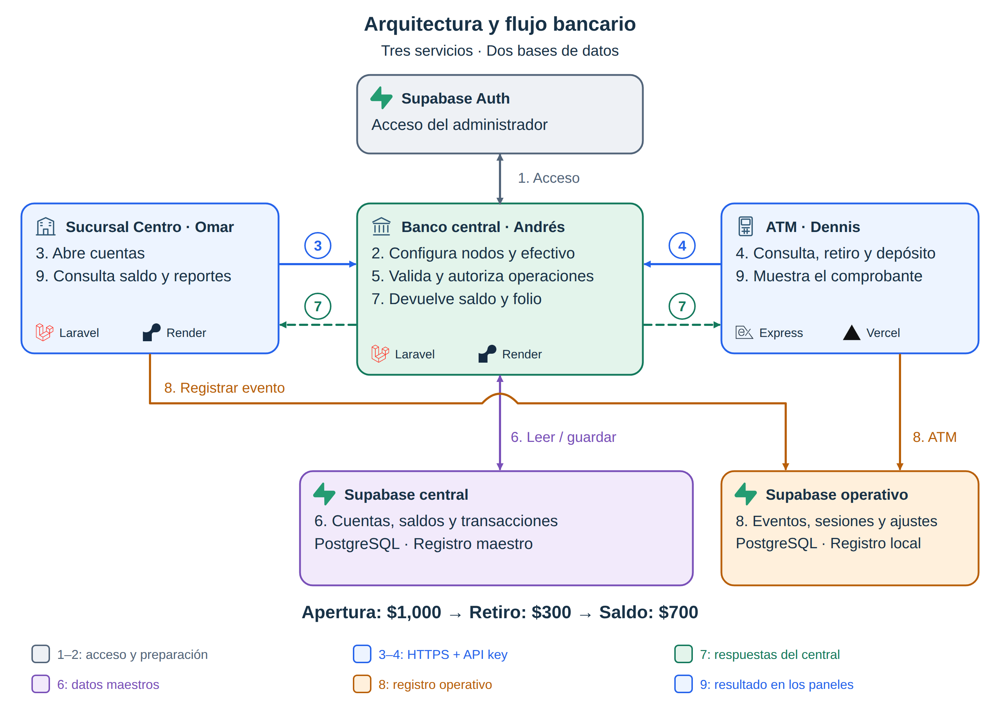

*Diagrama 1. Arquitectura completa y recorrido de las solicitudes entre los tres servicios y los dos proyectos Supabase.*

Los pasos **1 y 2** preparan los nodos y su autenticación; **3 y 4** representan la apertura y el retiro; **5 a 7** corresponden a validación, persistencia central y respuesta. En **8 y 9**, el nodo registra el evento local y muestra el resultado. Las flechas azules representan solicitudes, las verdes respuestas, las moradas datos centrales y las naranjas registros operativos; las grises identifican la autenticación.

> **Independencia de los nodos:** la sucursal y el ATM pueden comunicarse con el central sin depender del proceso del otro. Todas las operaciones monetarias requieren autorización central.

## Implementación de los nodos

### Banco central — Laravel y Composer

En `banco-central/` implementamos la API y el panel administrativo. Utilizamos controladores Laravel para validar solicitudes y un servicio bancario para ejecutar las operaciones. Composer instala las dependencias PHP; las migraciones crean tablas, índices y restricciones PostgreSQL.

Desde el panel registramos sucursales y cajeros, asignamos responsables, generamos API keys y distribuimos efectivo. También administramos cuentas, bloqueos, historial por nodo y reportes globales.

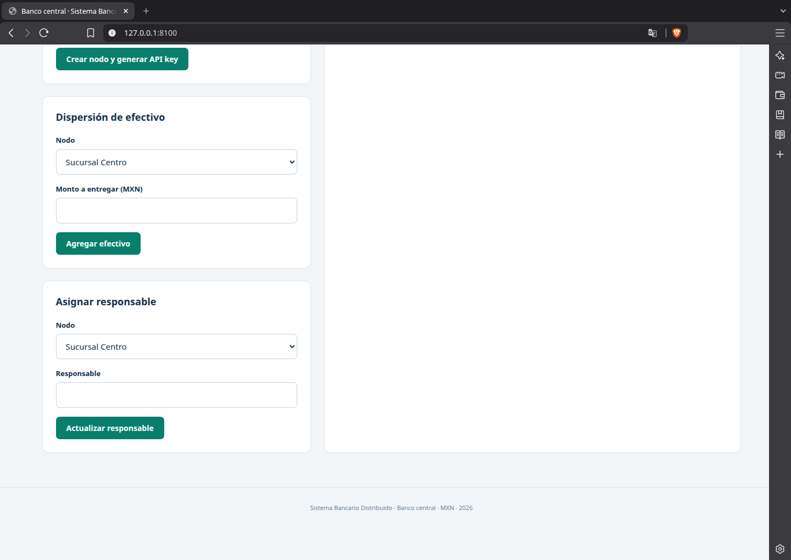

*Figura 1. Panel central para asignar efectivo y responsables a los nodos. El saldo de una cuenta y el efectivo disponible se administran por separado.*

### Sucursal — Laravel y API central

En `sucursal/` desarrollamos el panel del ejecutivo. `CentralClient` utiliza el cliente HTTP de Laravel con `CENTRAL_URL` y `X-API-Key`. La apertura envía titular, saldo inicial y PIN; el central devuelve la cuenta creada. La sucursal permite consultar movimientos por cliente y descargar reportes CSV.

Después de recibir una confirmación monetaria, registramos el evento en `node_events` con el identificador de la transacción central. La figura 7 muestra la apertura y la figura 5 la persistencia operativa compartida.

### Cajero automático — Express, NPM y Vercel

En `cajero/` implementamos las rutas Express y la interfaz del cliente. NPM instala Express, `pg`, `express-session` y `connect-pg-simple`. El servidor valida la sesión, el PIN y el formato del importe; antes de solicitar un retiro verifica el efectivo del nodo.

El panel administrativo permite guardar la URL central y la API key. Usamos PostgreSQL para conservar sesiones y configuración entre invocaciones de Vercel. La configuración guardada desde el panel tiene prioridad sobre las variables de conexión del entorno.

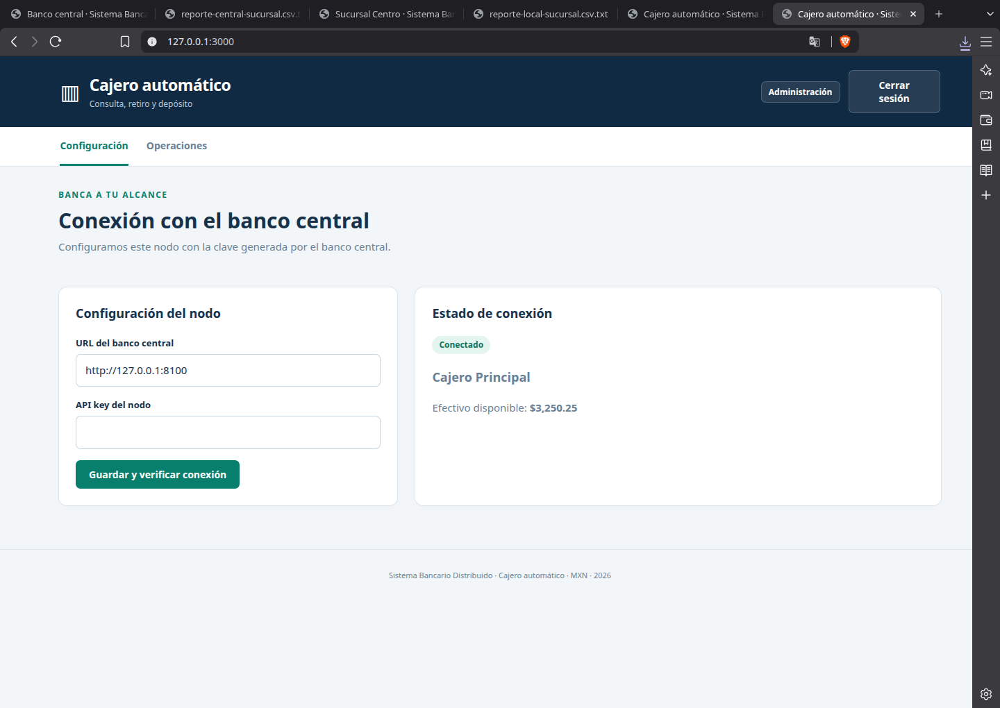

*Figura 2. Conexión del cajero con el banco central y consulta de su efectivo disponible; la API key permanece oculta.*

---

## Datos y seguridad en Supabase

### Autenticación administrativa

Registramos al administrador en **Supabase → Authentication → Users**. Laravel valida su correo y contraseña mediante Supabase Auth y comprueba que el UID coincide con `ADMIN_SUPABASE_ID`. Las variables `SUPABASE_URL` y `SUPABASE_ANON_KEY` identifican el proyecto central. La comunicación de sucursales y cajeros utiliza las API keys de cada nodo.

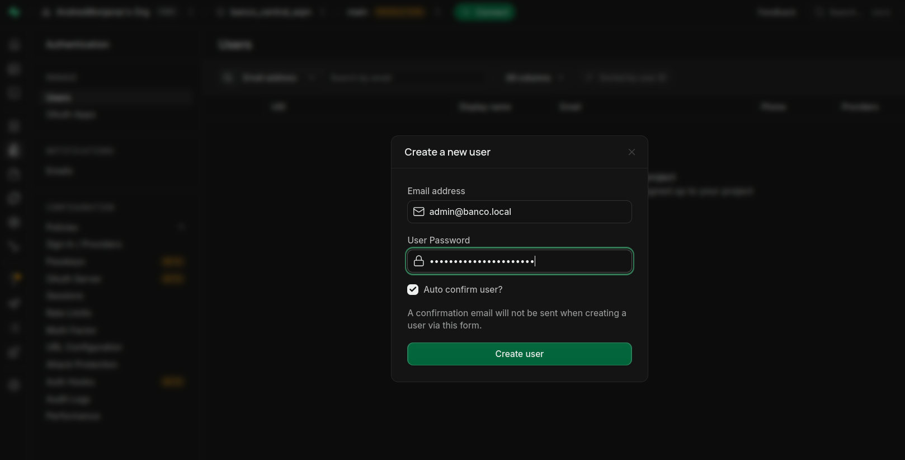

*Figura 3. Alta de la identidad administrativa utilizada por la integración de Supabase Auth con Laravel.*

### Dos proyectos y relaciones de datos

| Proyecto | Tablas principales | Función |
|---|---|---|
| Central | `users_accounts` | Cuenta, titular, saldo, estado, hash del PIN y sucursal de apertura |
| Central | `transactions` | Movimientos, nodo, monto, saldo posterior e integridad |
| Central | `nodes`, `cash_allocations` | Identidad y efectivo de los nodos e historial de asignaciones |
| Operativo | `node_events` | Evento local y referencia a la transacción central |
| Operativo | `node_runtime` | Último efectivo observado por la configuración del ATM |
| Operativo | `atm_sessions`, `node_configurations` | Sesiones Express y configuración cifrada del cajero |

*Tabla 3. Distribución de datos entre el proyecto central y el operativo. Fuente: elaboración propia del equipo.*

`users_accounts.branch_id`, `transactions.node_id` y `cash_allocations.node_id` referencian `nodes.id`. Los números de cuenta de origen y destino se validan en el backend; no tienen una llave foránea declarada. Los dos proyectos se relacionan mediante `central_transaction_id` a nivel de aplicación.

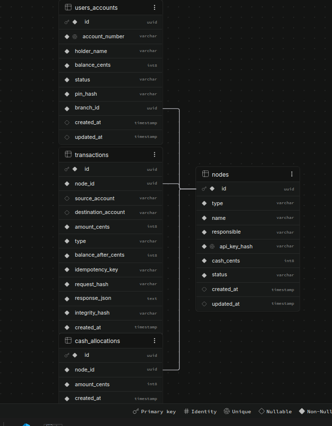

*Figura 4. Cuatro tablas bancarias centrales y tres relaciones hacia `nodes`.*

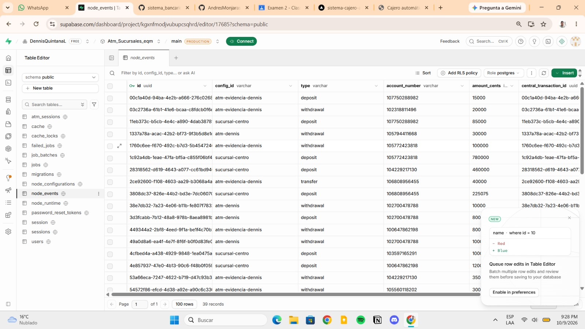

*Figura 5. Eventos locales con cuenta, importe en centavos y UUID de la transacción central. Esta captura posterior muestra 39 registros.*

Las tablas auxiliares de Laravel, como `cache`, `jobs` o `sessions`, pueden estar vacías porque usamos caché y sesiones de archivo y tareas síncronas. Los usuarios de Supabase Auth pertenecen a `auth.users`. `node_configurations` se utiliza cuando guardamos la conexión desde el panel del ATM.

### Protección de operaciones e historial

| Mecanismo | Implementación | Propósito |
|---|---|---|
| RLS y permisos | RLS habilitado y acceso directo revocado a `anon` y `authenticated` | Reservar las operaciones para los servidores autorizados |
| API keys y PIN | Hash en las tablas bancarias; validación en el backend | Comprobar la identidad del nodo y del cliente |
| Transacción SQL | `DB::transaction` y `lockForUpdate` | Actualizar saldo, efectivo e historial de forma atómica en el central |
| Idempotencia | Clave por solicitud y comprobación del contenido | Reintentar sin duplicar el movimiento monetario |
| Historial protegido | Trigger contra `UPDATE` y `DELETE`; hash SHA-256 | Impedir modificaciones ordinarias y conservar un dato de integridad |
| Sesiones y formularios | Sesiones del servidor y protección CSRF | Controlar el acceso a las acciones administrativas y del cliente |

*Tabla 4. Mecanismos de seguridad y consistencia implementados. Fuente: elaboración propia del equipo.*

Guardamos los importes como enteros en centavos y los mostramos en pesos. Si falla una validación central, la transacción SQL revierte sus cambios. El evento operativo se registra después de la confirmación; si ese registro falla, conservamos una copia para auditoría local sin repetir el movimiento de dinero.

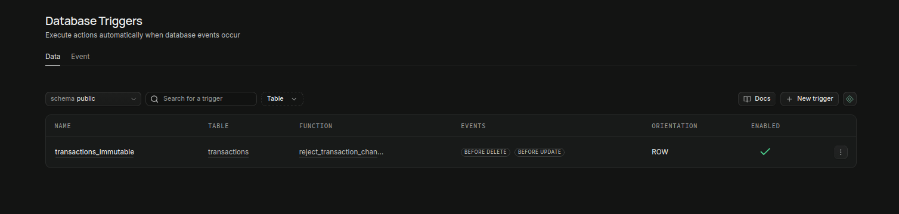

*Figura 6. Trigger `transactions_immutable`, activo antes de modificar o eliminar registros de `transactions`.*

El trigger protege las operaciones normales sobre la tabla. El hash SHA-256 es un dato de integridad; no representa una firma externa. Las credenciales PostgreSQL y las API keys privadas permanecen en el servidor y los archivos `.env` se excluyen de Git.

## Prueba de integración

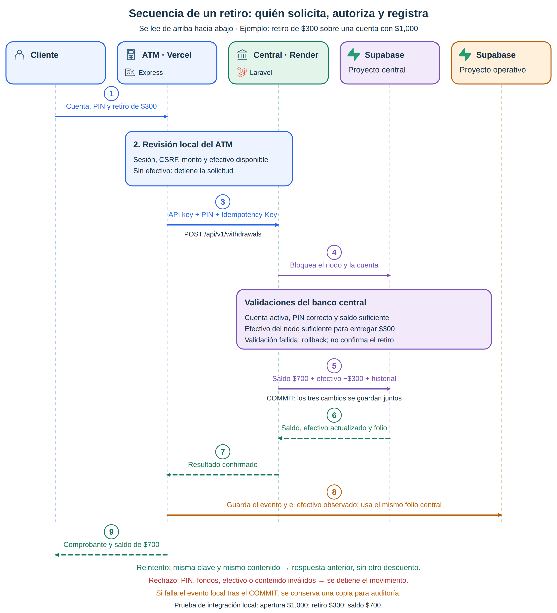

*Diagrama 2. Recorrido del retiro de $300 entre cliente, ATM, banco central y las dos bases. La respuesta confirmada muestra $700.*

| Paso | Acción | Evidencia |
|---|---|---|
| 1 | Registrar sucursal y ATM y asignar efectivo | Figura 1 |
| 2 | Abrir una cuenta con $1,000 desde la sucursal | Figura 7 |
| 3 | Verificar la cuenta en el banco central | Figura 8 |
| 4 | Retirar $300 desde el ATM | Figura 9 |
| 5 | Comprobar $700 y el movimiento central | Figuras 10 y 11 |

*Tabla 5. Secuencia de integración solicitada en el examen. Fuente: elaboración propia del equipo.*

Realizamos esta secuencia en el entorno local. Las direcciones `127.0.0.1` de las capturas identifican ese entorno; las operaciones públicas del ATM se muestran por separado más adelante.

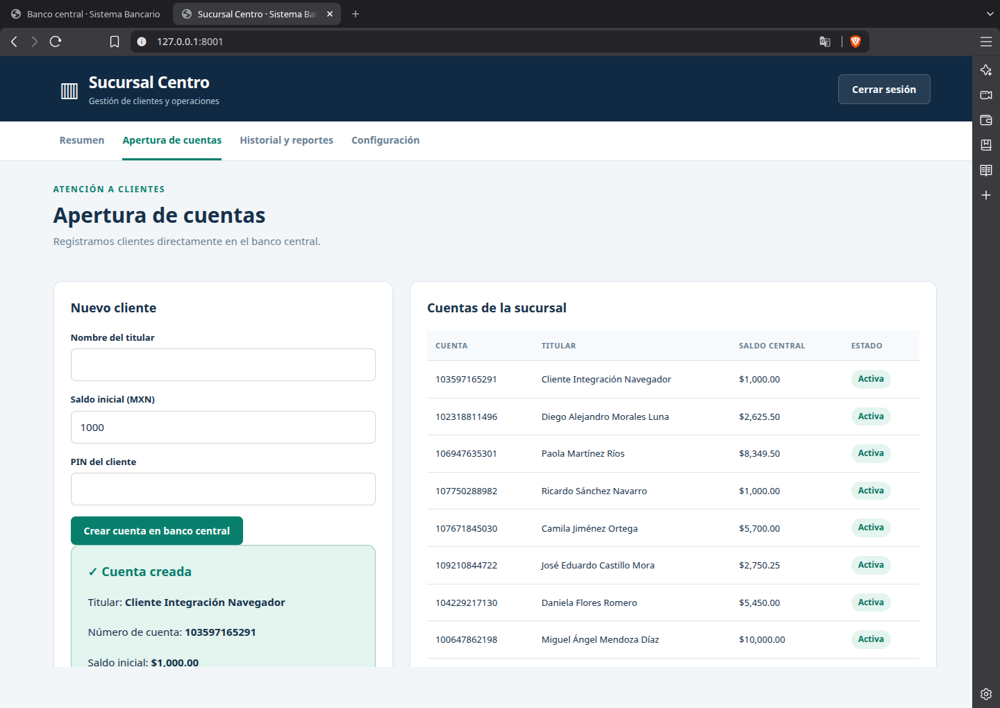

*Figura 7. Apertura del Cliente Integración Navegador con $1,000 y confirmación de la cuenta `103597165291`.*


*Figura 8. La misma cuenta aparece activa en el central con su titular y saldo inicial de $1,000.*

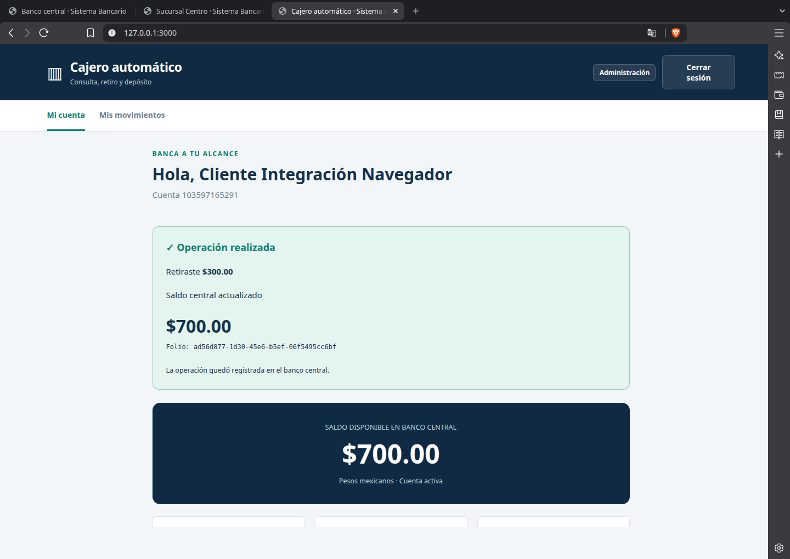

*Figura 9. El ATM confirma el retiro de $300, muestra su folio y actualiza el saldo a $700.*

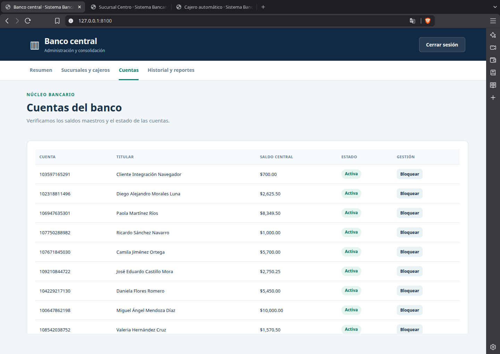

*Figura 10. El saldo central de $700 coincide con el comprobante del cajero.*

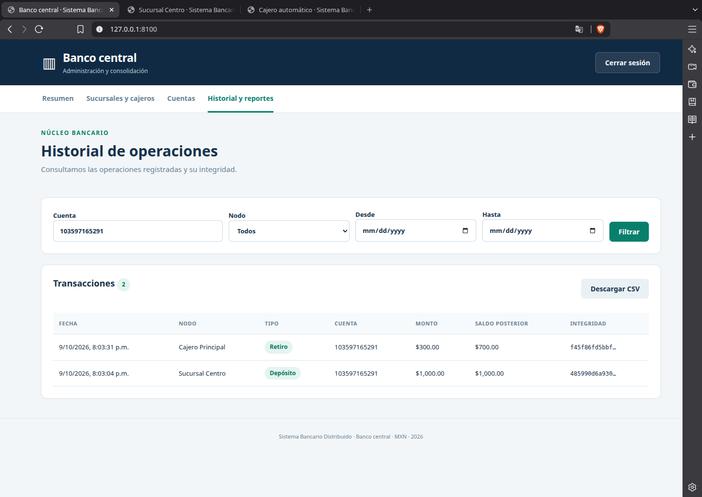

*Figura 11. Historial de la cuenta con el depósito de apertura y el retiro, identificados por nodo e integridad.*

### Consultas, reportes y velocidad

Los listados de cuentas e historial cargan **30 registros por página**. Las APIs aceptan `limit` y `offset`, conservan los filtros y devuelven los datos junto con información de paginación. El resumen consulta ocho movimientos recientes y calcula sus totales completos en SQL; el historial obtiene el nombre del nodo mediante un `JOIN`.

Los reportes CSV incluyen todas las operaciones que coinciden con sus filtros. Ampliamos la prueba con clientes ficticios, depósitos, retiros y transferencias; consultamos los movimientos por cuenta y por nodo.

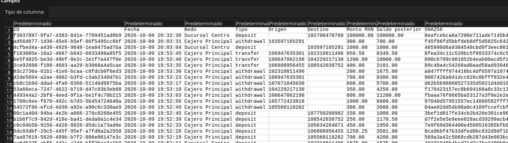

*Figura 12. Reporte con fecha, nodo, tipo, cuentas, monto, saldo posterior y SHA-256. La apertura de la cuenta de Dennis aparece junto a operaciones anteriores.*

---

## Despliegue y vinculación con Git

Laravel y Express implementan las aplicaciones; Render y Vercel las alojan. Composer y NPM administran sus dependencias. Supabase aporta PostgreSQL, Auth y la publicación Realtime de cuentas y transacciones centrales; nuestras interfaces consultan la API al cargar o actualizar su vista.

| Configuración | Banco central — Render | Sucursal — Render | ATM — Vercel |
|---|---|---|---|
| Directorio raíz del servicio | Vacío | Vacío en las capturas | `cajero` |
| Dockerfile | `./banco-central/Dockerfile` | `./sucursal/Dockerfile` | No aplica |
| Contexto Docker | `./banco-central` | `./sucursal` | No aplica |
| Ejecución | PHP y Laravel en Docker | PHP y Laravel en Docker | Express exportado como función |
| Persistencia | Supabase central | Supabase operativo | Supabase operativo |

*Tabla 6. Configuración de los alojamientos; las rutas Docker se interpretan desde la raíz del repositorio. Fuente: elaboración propia del equipo.*

### Render: banco central y sucursal

Cada Dockerfile instala PHP, las extensiones PostgreSQL y Composer. El arranque ejecuta las migraciones y escucha en el puerto asignado por Render. Utilizamos el servidor PHP integrado para el alcance académico de la práctica. El contexto Docker limita los archivos al módulo correspondiente.

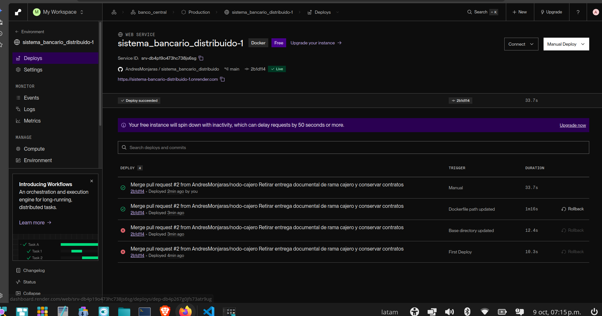

*Figura 13. Servicio central Live y despliegue asociado al commit `2b1d114`. La captura conserva el dominio usado en esa etapa.*

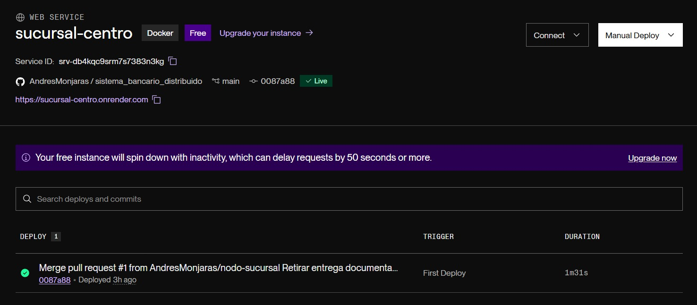

*Figura 14. Sucursal Centro Live, con URL propia y versión de Git identificada en el despliegue.*

### Vercel: cajero automático

Importamos el repositorio, seleccionamos `cajero` como raíz y configuramos las variables privadas. `vercel.json` dirige las solicitudes a `src/server.js` mediante `@vercel/node` e incluye `public/`. El central tiene una URL HTTPS accesible desde el ATM; PostgreSQL conserva la sesión entre invocaciones.

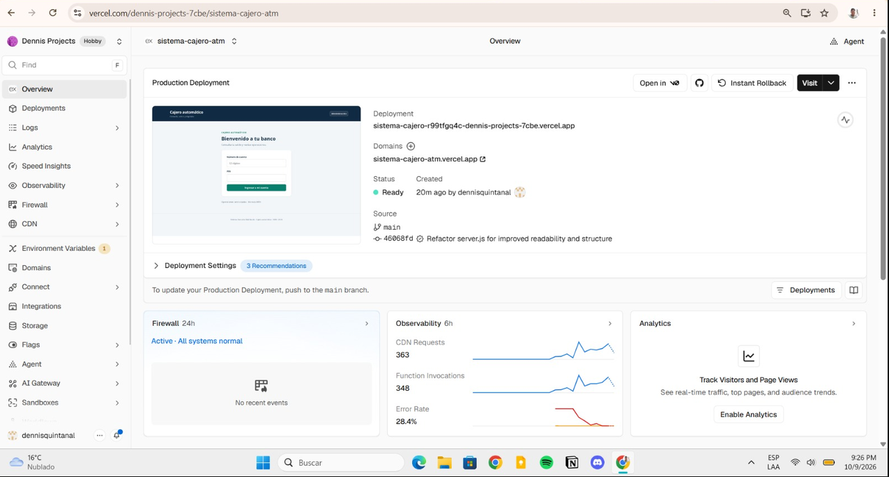

*Figura 15. Despliegue Ready del ATM, dominio público, rama `main` y commit `46068fd`.*

Vinculamos los servicios con Git. Los historiales de despliegue identifican sus commits y permiten distinguir una nueva versión de un redespliegue de la misma versión. Cada servicio conserva sus propias variables y configuración de construcción.

## Operaciones del ATM público

Las capturas siguientes muestran la cuenta de Dennis en el ATM publicado. Corresponden a una etapa posterior a la prueba de $1,000 → $700.

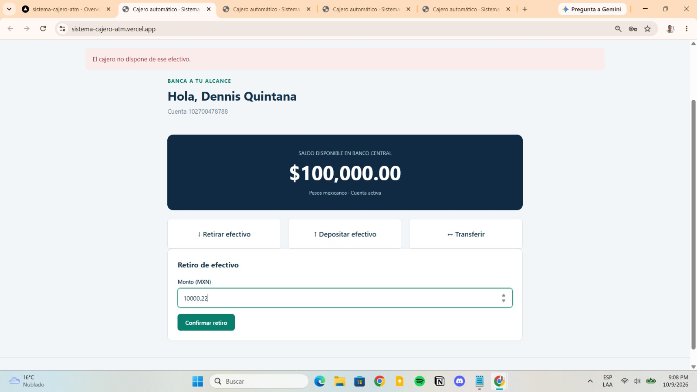

*Figura 16. Rechazo de $10,000.22 por efectivo insuficiente en el cajero. El saldo de la cuenta sigue en $100,000.*

El saldo de la cuenta y el efectivo del ATM son distintos: el cliente puede tener fondos y el cajero carecer del efectivo necesario para entregarlos. Express realiza la comprobación local y el central verifica nuevamente sus condiciones antes de autorizar un retiro.

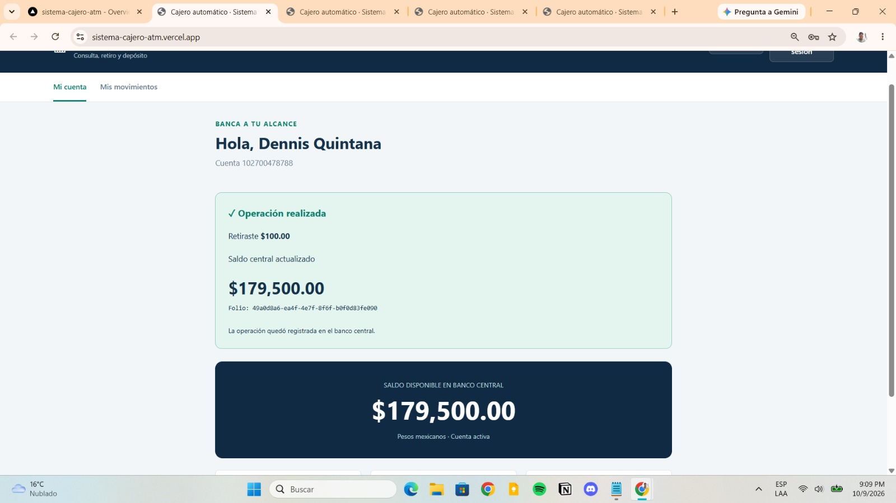

*Figura 17. Retiro de $100 confirmado en Vercel, con folio central y saldo posterior de $179,500.*

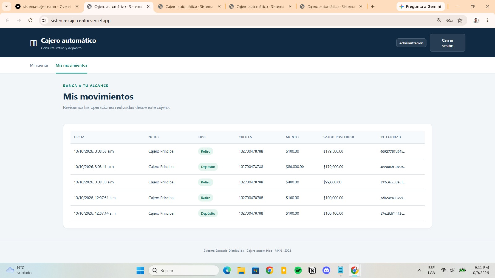

*Figura 18. Movimientos con importes, nodos, saldos posteriores e integridad. El folio del último retiro coincide con el evento operativo de la figura 5.*

El historial explica el cambio de saldo: depósito de $100, retiro de $100, retiro de $400, depósito de $80,000 y retiro de $100. Las dos primeras operaciones se iniciaron desde el ATM local; su aparición en el historial público conserva su origen. El último comprobante y el historial muestran el resultado posterior de $179,500.

---

## Contratos OpenAPI y organización del código

```text
sistema_bancario_distribuido/
├── README.md
├── assets/documentacion/    # diagramas, capturas y perfiles
├── banco-central/          # Laravel: API y administración central
├── sucursal/               # Laravel: atención y reportes
├── cajero/                 # Express: cliente y administración ATM
└── contratos/              # especificaciones OpenAPI
```

| Nodo | Contrato | Funciones descritas |
|---|---|---|
| Banco central | [banco-central.openapi.yaml](contratos/banco-central.openapi.yaml) | Nodos, cuentas, operaciones, historial y reportes |
| Sucursal | [sucursal.openapi.yaml](contratos/sucursal.openapi.yaml) | Apertura de cuentas, consultas y reportes locales |
| ATM | [cajero.openapi.yaml](contratos/cajero.openapi.yaml) | Sesión, saldo, retiro, depósito, transferencia y configuración |

*Tabla 7. Contratos de las APIs de los tres servicios. Fuente: elaboración propia del equipo.*

Organizamos las aplicaciones en módulos independientes dentro del repositorio de integración. Cada módulo conserva su [README central](banco-central/README.md), [README de sucursal](sucursal/README.md) o [README de ATM](cajero/README.md), además de sus dependencias y configuración. Los ejemplos `.env.example` contienen los nombres de las variables sin las credenciales del despliegue.

### Configuración y ejecución local

Necesitamos **PHP 8.2 o superior**, **Composer 2**, **Node.js 22 o superior con NPM** y acceso a los dos proyectos PostgreSQL de Supabase. PHP requiere las extensiones `pdo_pgsql`, `mbstring`, `xml` y `zip`; para las pruebas Laravel también utilizamos `pdo_sqlite`. Los contenedores de Render incluyen PHP 8.3 y Composer 2.

En cada módulo copiamos `.env.example` a `.env` y completamos las variables correspondientes. En Render y Vercel las registramos en el panel de variables de entorno del servicio.

| Nodo | Variables | Función y origen |
|---|---|---|
| Central y sucursal | `APP_KEY`, `APP_ENV`, `APP_URL`, `APP_DEBUG` | Generamos la clave con `php artisan key:generate`. La URL identifica la aplicación; en nube usamos `APP_ENV=production` y `APP_DEBUG=false`. |
| Central y sucursal | `DB_CONNECTION`, `DB_HOST`, `DB_PORT`, `DB_DATABASE`, `DB_USERNAME`, `DB_PASSWORD`, `DB_SSLMODE` | Usamos `pgsql` y `require` para SSL. Obtenemos host, puerto y usuario en Supabase → Connect → Session pooler; configuramos la contraseña de ese proyecto. El central utiliza la base central y la sucursal la operativa. |
| Central | `SUPABASE_URL`, `SUPABASE_ANON_KEY`, `ADMIN_SUPABASE_ID` | URL y clave pública del proyecto central; el UID procede del administrador creado en Authentication → Users. |
| Central y sucursal | `ADMIN_EMAIL`, `ADMIN_PASSWORD` | Configuración administrativa privada. Con Supabase Auth activo, el inicio de sesión central utiliza las credenciales del usuario registrado en Auth. |
| Central | `ADMIN_TOKEN` | Token privado para las solicitudes administrativas con autenticación Bearer; no se entrega al cliente ni a los nodos. |
| Sucursal y ATM | `CENTRAL_URL` | Dirección de la API central, sin barra final: localmente `http://127.0.0.1:8100` y en nube la dirección HTTPS de la tabla 2. |
| Sucursal y ATM | `NODE_API_KEY` | Clave generada al registrar ese nodo en el panel central. Cada sucursal y cajero utiliza su propia clave. |
| Sucursal y ATM | `NODE_CONFIG_ID` | Identificador local de configuración, por ejemplo `sucursal-centro` o `atm-dennis`; conserva el mismo valor entre despliegues. Es distinto del UUID del nodo central. |
| ATM | `NODES_DATABASE_URL` | Cadena PostgreSQL del proyecto operativo, obtenida con los datos de conexión de Supabase. Conserva sesiones, configuración y eventos. |
| ATM | `SESSION_SECRET`, `ADMIN_EMAIL`, `ADMIN_PASSWORD` | Secreto de sesión y credenciales del panel del cajero definidos durante la configuración. `SESSION_SECRET` también protege la configuración cifrada guardada. |
| ATM | `NODE_ENV`, `COOKIE_SECURE`, `PORT` | En nube usamos `production` y `true`; localmente `development`, `false` y puerto `3000`. Vercel ejecuta la función sin abrir ese puerto. |

*Tabla 8. Variables principales de cada nodo y origen de sus valores. Fuente: elaboración propia del equipo.*

Preparamos cada aplicación Laravel desde su directorio:

```bash
cp .env.example .env
composer install
php artisan key:generate
```

Después de configurar la conexión PostgreSQL ejecutamos `php artisan migrate` en el central y en la sucursal. En el proyecto operativo aplicamos además [cajero/database/schema.sql](cajero/database/schema.sql) desde el SQL Editor de Supabase para crear las tablas del ATM.

En `cajero/` instalamos las dependencias y completamos el archivo de configuración:

```bash
cp .env.example .env
npm ci
```

Iniciamos los servicios en terminales independientes:

```bash
# Desde banco-central/
php artisan serve --host=127.0.0.1 --port=8100

# Desde sucursal/
php artisan serve --host=127.0.0.1 --port=8001

# Desde cajero/
PORT=3000 npm start
```

En el entorno local, los nodos usan `CENTRAL_URL=http://127.0.0.1:8100`. Para el despliegue utilizan la URL pública del central indicada en la tabla 2. Después de modificar la configuración Laravel, ejecutamos `php artisan config:clear`.

### Cómo montar toda la infraestructura

El orden de montaje es **Supabase → banco central → registro de nodos → sucursal → ATM → prueba integrada**. Así obtenemos la URL del central y las API keys antes de conectar los otros servicios. Las rutas de la tabla 6 corresponden a la estructura actual del repositorio compartido.

#### 1. Obtener el código y preparar Supabase

Descargamos el proyecto para preparar las claves y revisar sus archivos de configuración:

```bash
git clone https://github.com/AndresMonjaras/sistema_bancario_distribuido.git
cd sistema_bancario_distribuido
```

Creamos dos proyectos Supabase: uno para el central y otro para la persistencia operativa compartida por sucursal y ATM. Guardamos por separado sus contraseñas y datos de conexión. En **Connect → Session pooler** obtenemos el host, el puerto y el usuario `postgres.REFERENCIA_DEL_PROYECTO`; usamos estos valores con SSL en las variables de la tabla 8. [Referencia: conexiones PostgreSQL de Supabase](https://supabase.com/docs/guides/database/connecting-to-postgres).

En el proyecto central creamos y confirmamos el administrador en **Authentication → Users**. Registramos su UID en `ADMIN_SUPABASE_ID`, junto con la URL del proyecto y su clave pública. En el proyecto operativo ejecutamos [cajero/database/schema.sql](cajero/database/schema.sql) desde **SQL Editor**; este archivo prepara las tablas del ATM y sus permisos.

#### 2. Publicar el banco central en Render

Preparamos `banco-central/.env` a partir del ejemplo, instalamos sus dependencias y generamos una `APP_KEY` propia con los comandos de instalación. La clave obtenida se conserva en las variables del servicio.

En Render creamos un **Web Service**, conectamos el repositorio y seleccionamos la rama `main` con entorno **Docker**. Dejamos **Root Directory** vacío, establecemos **Dockerfile Path** en `./banco-central/Dockerfile` y **Docker Build Context Directory** en `./banco-central`. El chequeo de salud utiliza `/api/v1/health`. [Referencia: Laravel con Docker en Render](https://render.com/docs/deploy-php-laravel-docker).

Configuramos `APP_ENV=production`, `APP_DEBUG=false`, `APP_KEY` y las variables `DB_*` del proyecto central. Añadimos la configuración de Supabase Auth y los valores administrativos privados del ejemplo. Conservamos `SESSION_DRIVER=file`, `CACHE_STORE=file` y `QUEUE_CONNECTION=sync` para esta implementación. La conexión a PostgreSQL la selecciona `DB_CONNECTION=pgsql`; el controlador bancario predeterminado ejecuta las operaciones SQL mediante Laravel.

Al publicar, el Dockerfile instala dependencias y ejecuta las migraciones antes de iniciar el servidor. Las migraciones crean las tablas bancarias, relaciones, restricciones, RLS y el trigger del historial. Obtenemos el dominio asignado por Render, lo registramos como `APP_URL` y guardamos la configuración. Comprobamos que `/api/v1/health` responda con `status: ok` y `database: Supabase PostgreSQL`.

En Supabase central habilitamos `users_accounts` y `transactions` en la publicación Realtime. Esta configuración permite publicar cambios de esas tablas; los paneles de la práctica siguen consultando sus datos mediante la API.

#### 3. Registrar la sucursal y el ATM

Abrimos el panel del central e iniciamos sesión con el administrador de Supabase Auth. Creamos un nodo de tipo **sucursal** y otro de tipo **ATM**, asignamos nombres y responsables y distribuimos efectivo. Para la prueba de retiro, el ATM debe disponer de al menos $300.

Conservamos la API key que devuelve el registro de cada nodo y la asignamos únicamente a su servicio. Definimos identificadores locales de configuración, como `sucursal-centro` y `atm-dennis`. `NODE_CONFIG_ID` identifica la configuración local; la API key determina el nodo central autorizado.

#### 4. Publicar la sucursal en Render

Creamos otro Web Service Docker desde `main`. Dejamos la raíz vacía y configuramos `./sucursal/Dockerfile` y contexto `./sucursal`. Generamos una `APP_KEY` distinta de la del central y añadimos `APP_ENV=production`, `APP_DEBUG=false` y los datos `DB_*` del proyecto **operativo**.

Establecemos las credenciales privadas del ejecutivo, `CENTRAL_URL` con el dominio HTTPS del central, `NODE_API_KEY` con la clave de la sucursal y `NODE_CONFIG_ID=sucursal-centro`. El arranque ejecuta las migraciones de la sucursal y crea su persistencia local. Después de publicar, actualizamos `APP_URL` con el dominio propio de esta aplicación.

Ingresamos al panel de sucursal y revisamos **Configuración**. Si existe una conexión guardada anteriormente, actualizamos allí la URL y la clave. El resumen y la apertura de cuentas deben comunicarse con el central.

#### 5. Publicar el ATM en Vercel

Importamos el repositorio en Vercel y seleccionamos **Root Directory: `cajero`**. Conservamos `vercel.json`, que define la función Express y los archivos de la interfaz; no añadimos un comando para mantener `npm start` escuchando un puerto. [Referencia: Express en Vercel](https://vercel.com/docs/frameworks/backend/express).

Registramos las variables de `cajero/.env.example` para producción: `NODE_ENV=production`, `COOKIE_SECURE=true`, un `SESSION_SECRET` privado, las credenciales administrativas del ATM, `CENTRAL_URL`, `NODE_API_KEY` del cajero y `NODE_CONFIG_ID=atm-dennis`. En `NODES_DATABASE_URL` usamos la cadena de conexión del **proyecto operativo**, con los datos del pooler y la contraseña codificada para una URL cuando contenga caracteres especiales.

Publicamos el proyecto y abrimos su dominio HTTPS. Desde **Administración** comprobamos la URL central, la identidad del ATM y el efectivo asignado. Las sesiones y la configuración se guardan en PostgreSQL; una conexión guardada desde el panel tiene prioridad sobre las variables del entorno.

#### 6. Comprobar los tres servicios y vincular las actualizaciones

Abrimos simultáneamente las URL de la tabla 2. Desde la sucursal registramos un cliente con $1,000 y un PIN de cuatro dígitos. Verificamos la cuenta en el central, ingresamos al ATM con ese número y PIN y retiramos $300. Comprobamos $700 de saldo, la reducción de efectivo del cajero y el mismo folio en el historial central y el evento operativo.

Cada servicio publica un endpoint `/api/v1/health`, pero la comprobación completa requiere la operación entre nodos: la salud local de sucursal o ATM no demuestra por sí sola que el central pueda autorizarla.

En Render configuramos el despliegue automático desde `main`; en Vercel vinculamos la rama de producción del mismo repositorio. Después de un cambio verificamos el commit y el resultado de construcción de cada servicio. Las variables privadas permanecen en cada plataforma; los archivos locales de entrega y preparación se excluyen de los paquetes de despliegue.

### Solución de problemas frecuentes

| Síntoma | Comprobación y solución |
|---|---|
| El nodo no conecta con el central | Revisamos `CENTRAL_URL`, el dominio vigente y que la API central esté disponible. En nube utilizamos HTTPS; `localhost` identifica el propio servicio. |
| Cambiamos la URL del ATM, pero sigue usando la anterior | Actualizamos también la conexión desde el panel administrativo del ATM. La configuración guardada tiene prioridad sobre las variables del entorno. |
| La API rechaza la conexión del nodo | Comprobamos que el nodo esté activo y que `NODE_API_KEY` corresponda a ese nodo. Si se regeneró la clave, actualizamos la configuración del servicio. |
| PostgreSQL no conecta o faltan tablas | Verificamos los datos del Session pooler, SSL y el proyecto elegido. Ejecutamos las migraciones Laravel y aplicamos el esquema operativo del ATM. |
| El administrador central no puede iniciar sesión | Revisamos el usuario confirmado en Supabase Auth, sus credenciales y la coincidencia de su UID con `ADMIN_SUPABASE_ID`. Limpiamos la caché de configuración Laravel. |
| El ATM pierde la sesión o no inicia en Vercel | Revisamos `NODES_DATABASE_URL`, `SESSION_SECRET` y `COOKIE_SECURE=true`. Conservamos el secreto usado para cifrar la configuración; localmente HTTP requiere `COOKIE_SECURE=false`. |
| El retiro se rechaza aunque la cuenta tiene saldo | Consultamos el efectivo disponible del ATM y el estado de la cuenta y del nodo. El efectivo se asigna desde el central y es independiente del saldo bancario. |

*Tabla 9. Diagnóstico de conexión, autenticación, persistencia y disponibilidad de efectivo. Fuente: elaboración propia del equipo.*

### Verificación y pruebas

Ejecutamos las pruebas específicas desde el directorio de cada módulo, con sus dependencias de desarrollo instaladas:

```bash
# Desde banco-central/
php artisan test

# Desde sucursal/
php artisan test

# Desde cajero/
npm test
```

Estos comandos ejecutan los casos disponibles en cada módulo. Las pruebas Laravel utilizan SQLite en memoria según `phpunit.xml`; NPM ejecuta el descubrimiento de pruebas de Node.js. El resumen indica cuántos casos se ejecutaron y cuántos pasaron o fallaron; una ejecución sin casos no acredita el funcionamiento bancario.

La comprobación funcional sigue la tabla 5: registramos los nodos, abrimos una cuenta con $1,000, retiramos $300 y verificamos $700 y el movimiento central. También comprobamos el acceso del administrador, el rechazo por efectivo insuficiente y la coincidencia del folio entre el historial central y el evento operativo. Las figuras conservan los resultados de estas operaciones.

Los resultados principales de la práctica fueron la apertura remota de cuentas, el retiro autorizado con saldo consistente, la persistencia central y operativa y la publicación de las tres aplicaciones. Los logos de los diagramas proceden de [Simple Icons](https://github.com/simple-icons/simple-icons).
