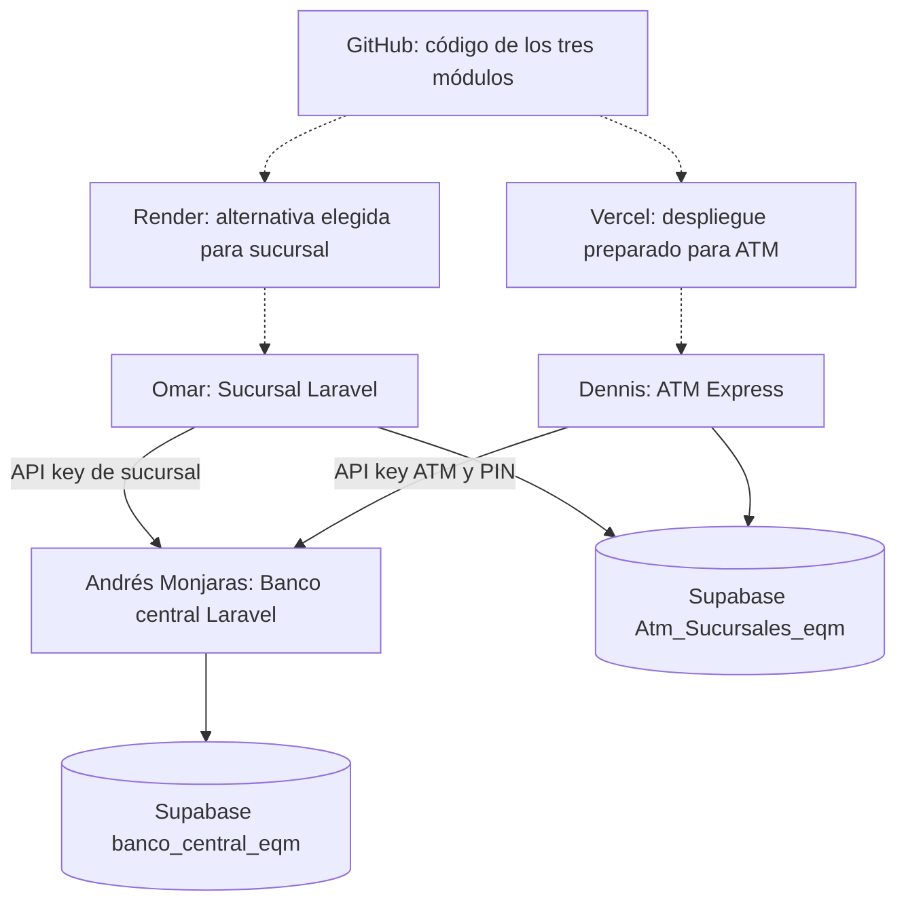

# Sistema Bancario Distribuido

Nosotros implementamos tres nodos bancarios independientes y utilizamos dos proyectos Supabase para separar los datos maestros del banco de la persistencia operativa de sucursales y cajeros. La prueba integrada registró una cuenta con $1,000.00, ejecutó un retiro de $300.00 y comprobó el saldo central de $700.00.

## Integrantes y perfiles de GitHub

| Andrés Monjaras | Omar | Dennis |
|---|---|---|
|  |  |  |
| [@AndresMonjaras](https://github.com/AndresMonjaras) | [@omarsyn](https://github.com/omarsyn) | [@DennisQuintanaL](https://github.com/DennisQuintanaL) |
| Banco central | Sucursal | Cajero automático |

GitHub reconoció los commits de cada integrante con su perfil. Conservamos el [commit de Omar](https://github.com/AndresMonjaras/sistema_bancario_distribuido/commit/96d4c226992b5b22544c5830647a2e25d050dd74) y el [commit de Dennis](https://github.com/AndresMonjaras/sistema_bancario_distribuido/commit/38690cc38f740ebd5c2e6780dfee16b42d95cacf), creados desde sus respectivos usuarios y máquinas. Los integrantes también aparecen en [Contributors](https://github.com/AndresMonjaras/sistema_bancario_distribuido/graphs/contributors).

## Distribución de los nodos

| Integrante y entorno | Nodo | Tecnología | Módulo | Responsabilidad |
|---|---|---|---|---|
| Andrés Monjaras — máquina central | Banco central | Laravel 12 / PHP 8.3 | `banco-central/` | Administrar nodos, responsables, claves, efectivo, cuentas e historial global |
| Omar — máquina de sucursal, entorno WSL con usuario `hadoop` | Sucursal Centro | Laravel 12 / PHP 8.3 | `sucursal/` | Abrir cuentas, consultar movimientos y emitir reportes |
| Dennis — máquina de cajero, entorno WSL con usuario `hadoop` | Cajero Principal | Express.js / Node.js | `cajero/` | Consultar saldo, retirar, depositar y transferir; verificar el efectivo local |

Cada servicio tuvo su configuración y proceso independientes. La sucursal y el cajero se autenticaron ante la API central mediante una clave de nodo. El banco central conservó la autoridad sobre los saldos; los nodos registraron sus operaciones locales en el segundo proyecto Supabase.

## Dónde y cómo utilizamos Laravel

Nosotros utilizamos Laravel en el banco central para implementar la API de cuentas y operaciones monetarias, el panel administrativo, la generación y renovación de API keys, la asignación de responsables, la dispersión de efectivo, los bloqueos y los reportes globales. Las migraciones crearon las tablas y las restricciones en PostgreSQL.

En la sucursal utilizamos otra aplicación Laravel. Su panel permitió abrir cuentas y consultar operaciones mediante la API central. La sucursal mantuvo sus registros operativos en su proyecto Supabase y su configuración privada en el servidor.

## Dónde y cómo utilizamos Supabase distribuido

Nosotros utilizamos **dos proyectos Supabase independientes**:

| Proyecto | Datos persistidos | Servicio con acceso |
|---|---|---|
| `banco_central_eqm` | `users_accounts`, `transactions`, `nodes`, `cash_allocations` | Banco central |
| `Atm_Sucursales_eqm` | `node_events`, `node_runtime`, `node_configurations`, `atm_sessions` | Sucursal y ATM |

En el banco central persistimos los números de cuenta, titulares, PIN cifrado mediante hash, saldos, estados, nodos y transacciones. Cada operación monetaria bloqueó los registros afectados y actualizó el saldo, el efectivo y el historial dentro de una transacción PostgreSQL. Calculamos los montos en centavos para evitar errores por números decimales.

En el proyecto de ATM/Sucursal persistimos el identificador de la transacción central, el nodo local, la cuenta, el tipo, el monto y la fecha. El ATM también contó con persistencia de su efectivo, configuración cifrada y sesiones PostgreSQL para el despliegue serverless. Si falló el registro local después de una operación central exitosa, el servicio conservó la operación pendiente de auditoría local para no repetir el movimiento de dinero.

Habilitamos RLS en las tablas bancarias y revocamos el acceso directo de los roles públicos `anon` y `authenticated`. Las credenciales PostgreSQL permanecieron en los servidores. Instalamos un trigger que rechazó modificaciones y eliminaciones de las transacciones centrales; cada transacción también conservó un identificador SHA-256 de integridad. Las API keys se guardaron mediante hash en el banco central. Habilitamos la publicación Realtime para cuentas y transacciones centrales; los paneles consultaron la API para mostrar los datos.

## Dónde y cómo utilizamos Vercel

Preparamos **el ATM Express** para Vercel en el directorio `cajero/`. Incluimos el archivo `vercel.json` y exportamos la aplicación Express para ejecutarla como función. El servidor leyó la URL central, su API key y las credenciales desde variables de entorno; las sesiones y la configuración del ATM se persistieron en PostgreSQL para sobrevivir entre invocaciones.

La configuración de Vercel correspondió a importar este repositorio, elegir `cajero` como raíz y agregar las variables de `cajero/.env.example`. El banco central necesitó una URL HTTPS accesible desde Vercel. **El enlace público de Vercel quedó pendiente de despliegue y verificación.**

## Dónde y cómo contemplamos Coolify y Render

Destinamos **la sucursal Laravel** al despliegue autoalojado con Coolify. Preparamos `sucursal/Dockerfile` para instalar PHP, Composer y PostgreSQL, ejecutar migraciones e iniciar el servicio. La configuración correspondió a conectar este repositorio, usar `/sucursal` como raíz, seleccionar Dockerfile y exponer el puerto `8001`.

Durante la integración encontramos problemas con la instancia disponible de Coolify y, por indicación del equipo, **elegimos Render como alternativa**. Conservamos el mismo Dockerfile para un Web Service Docker con raíz `sucursal` y añadimos `render.yaml` para la configuración mediante Blueprint. **Los enlaces públicos de Coolify/Render quedaron pendientes de verificación; no formaron parte de las capturas de funcionamiento.**

## Repositorio y despliegue continuo

Organizamos los tres módulos en el repositorio [sistema_bancario_distribuido](https://github.com/AndresMonjaras/sistema_bancario_distribuido). Incluimos los archivos Docker y Vercel para vincular los despliegues a Git. Las plataformas pudieron recibir nuevos despliegues desde `main` al activar la integración Git y el despliegue automático. La evidencia de una ejecución automática de la plataforma quedó pendiente hasta contar con acceso y una aplicación publicada.

## Funcionalidad comprobada

Nosotros abrimos la cuenta desde la máquina de sucursal, verificamos el saldo inicial en central, ingresamos al ATM y ejecutamos el retiro. Comprobamos el saldo final de $700.00 en el banco central y consultamos el historial con el depósito inicial y el retiro.

La documentación funcional con capturas y pies de imagen quedó en [entrega_examen/README.md](entrega_examen/README.md). También generamos [la versión Word](entrega_examen/Documentacion_funcional.docx) y [la versión HTML](entrega_examen/Documentacion_funcional.html).

## Contratos y código

- [Contrato de endpoints](entrega_examen/contratos/ENDPOINTS.md).
- OpenAPI de cada nodo en `entrega_examen/contratos/`.
- `banco-central/`: Laravel y migraciones del núcleo.
- `sucursal/`: Laravel y registro local de sucursal.
- `cajero/`: Express, interfaz y configuración Vercel.
- `scripts/`: herramientas de verificación y generación de evidencias.

Los archivos `.env`, las claves y los datos de conexión se excluyeron del repositorio. Los ejemplos de configuración se incluyeron como `.env.example`.

## Enlaces y estado de las aplicaciones

| Aplicación | Enlace / estado |
|---|---|
| Banco central | [Panel HTTPS](https://incurred-paper-occupational-isa.trycloudflare.com) — salud verificada con Supabase |
| ATM en Vercel | Configuración preparada; publicación pendiente |
| Sucursal en Render | Dockerfile y Blueprint preparados; publicación pendiente |

La dirección central fue temporal y requirió mantener activo el servicio en la máquina de Andrés.
