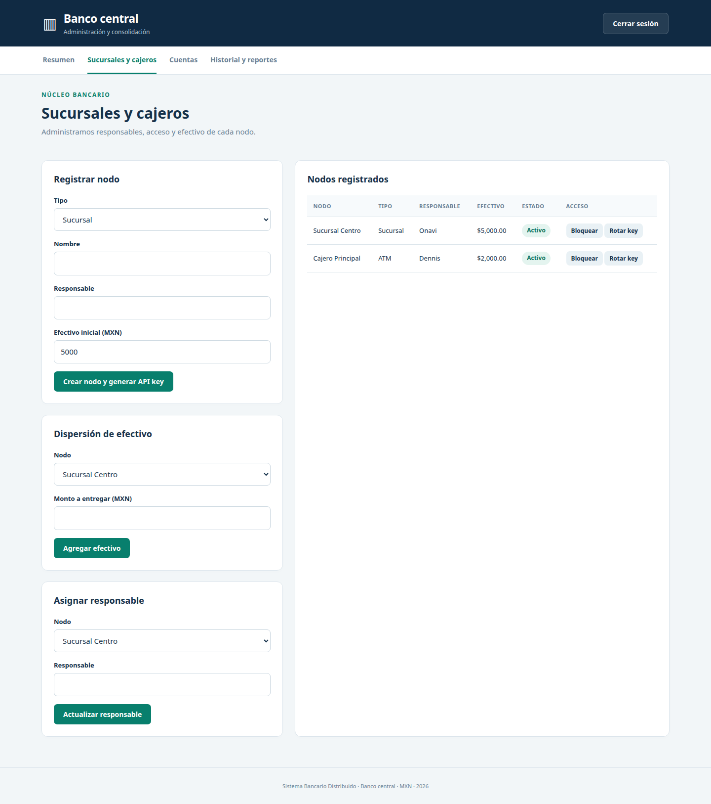
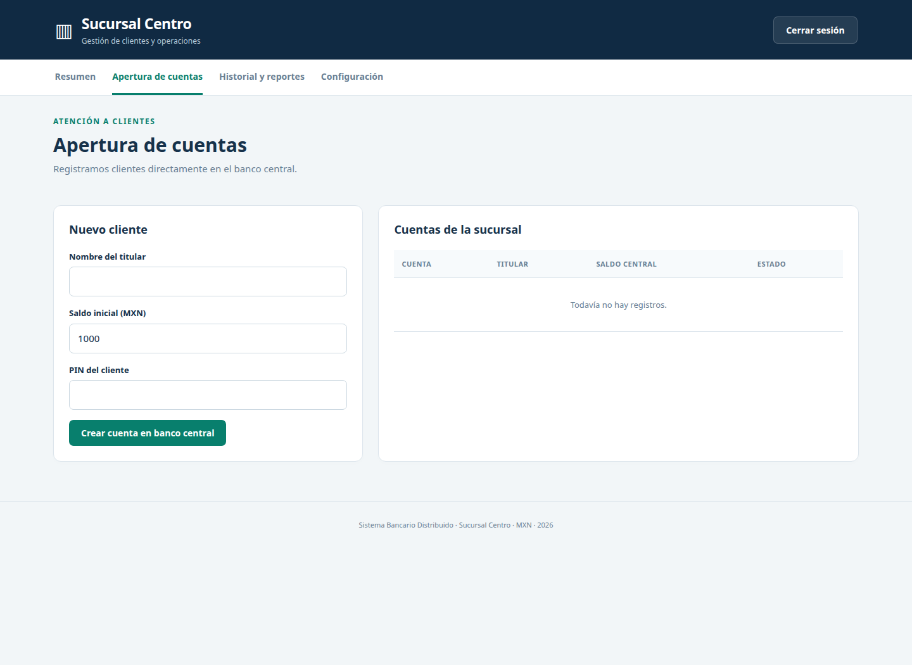
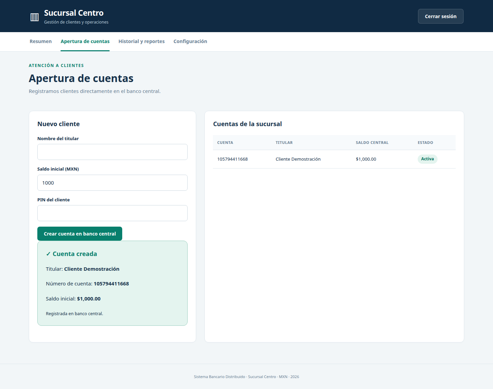
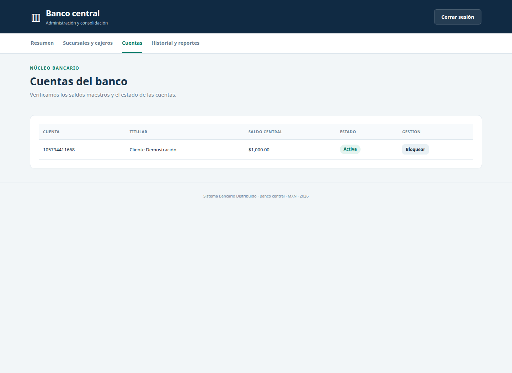
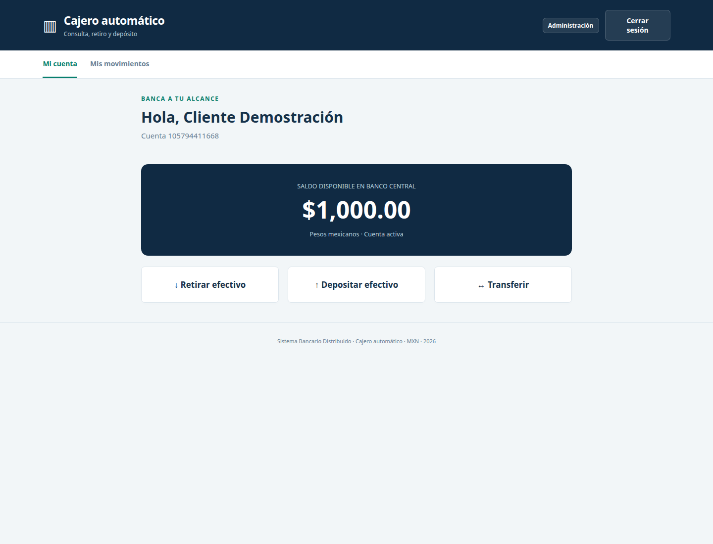
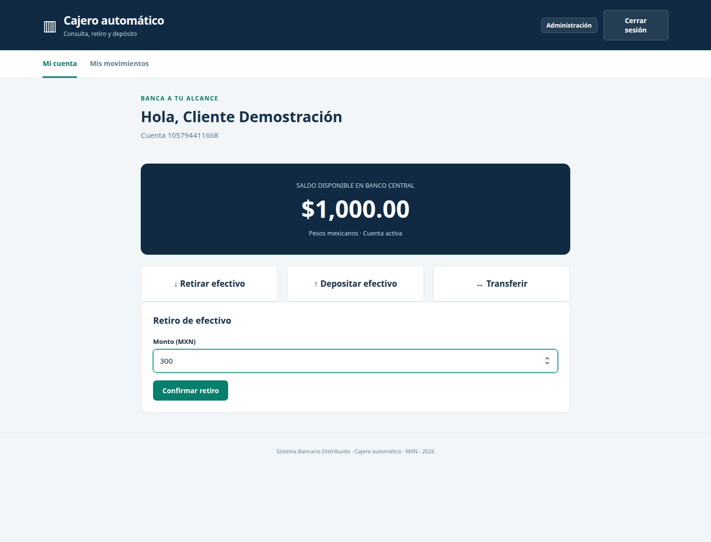
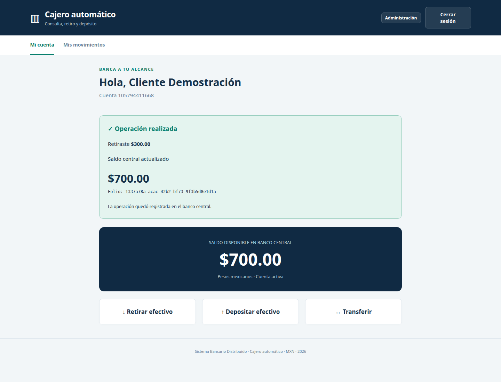
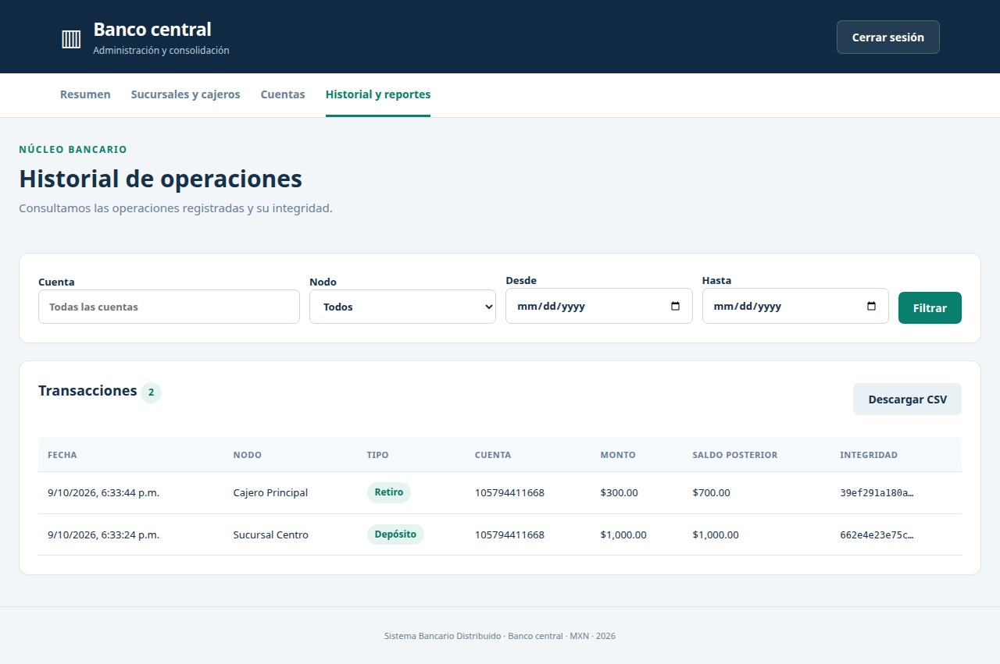

# Sistema Bancario Distribuido

**Examen práctico — 9 de octubre de 2026**

Nosotros implementamos un banco central con Laravel, una sucursal con Laravel y un cajero automático con Express.js. Ejecutamos cada componente en su entorno y utilizamos dos proyectos de Supabase: uno para las cuentas, los saldos y el historial central, y otro para los registros locales de sucursal y cajero.

## Administración del banco central

Nosotros registramos la Sucursal Centro y el Cajero Principal, asignamos responsables y distribuimos su efectivo inicial. La sucursal recibió $5,000.00 y el cajero recibió $2,000.00. Generamos una API key individual para conectar cada nodo con el banco central.

*Figura 1. Nosotros registramos los nodos, sus responsables y el efectivo disponible desde el panel del banco central.*

## Apertura de cuentas en la sucursal

Nosotros utilizamos el panel de la sucursal para registrar el nombre del cliente, el saldo inicial y su PIN. El formulario comunicó la operación al banco central.

*Figura 2. Nosotros accedimos al formulario de apertura de cuentas desde el entorno de la sucursal.*

Nosotros creamos la cuenta del Cliente Demostración con un saldo inicial de $1,000.00. El sistema devolvió el número de cuenta y mostró la confirmación de apertura.

*Figura 3. Nosotros registramos al cliente con $1,000.00 y recibimos la confirmación de la cuenta central.*

## Verificación de la cuenta central

Nosotros consultamos las cuentas desde el banco central y comprobamos que la cuenta creada por la sucursal apareció como activa, con el titular y el saldo inicial correctos.

*Figura 4. Nosotros verificamos la cuenta y su saldo inicial de $1,000.00 en el panel central.*

## Operaciones del cajero automático

Nosotros ingresamos al cajero con el número de cuenta y el PIN del cliente. Consultamos el saldo central y accedimos a las opciones de retiro, depósito y transferencia.

*Figura 5. Nosotros consultamos desde el cajero el saldo disponible de $1,000.00.*

Nosotros seleccionamos la operación de retiro e ingresamos un monto de $300.00. El cajero verificó el efectivo disponible y solicitó la autorización al banco central.

*Figura 6. Nosotros solicitamos el retiro de $300.00 desde la interfaz del cajero.*

Nosotros recibimos el comprobante del retiro, su folio y el saldo actualizado de $700.00. El sistema registró la operación central y descontó el efectivo correspondiente del cajero.

*Figura 7. Nosotros confirmamos el retiro de $300.00 y observamos el saldo central actualizado a $700.00.*

## Consistencia de saldos

Nosotros regresamos al panel central y comprobamos que el saldo de la misma cuenta fue $700.00 después del retiro. La información coincidió con el comprobante mostrado por el cajero.

*Figura 8. Nosotros comprobamos la consistencia del saldo final de $700.00 en el banco central.*

## Historial y reportes

Nosotros consultamos el historial global y observamos el depósito inicial de $1,000.00 realizado desde la sucursal y el retiro de $300.00 realizado desde el cajero. El panel mostró la fecha, el nodo, el tipo, la cuenta, el monto, el saldo posterior y el identificador de integridad de cada registro. También dispusimos de la opción para descargar el reporte en CSV.

*Figura 9. Nosotros consultamos las dos operaciones registradas y sus saldos posteriores desde el historial central.*

## Resultado de la prueba de integración

Nosotros completamos la prueba de apertura de cuenta, consulta y retiro entre los tres componentes. El saldo inicial fue $1,000.00; el retiro fue $300.00; y el saldo final comprobado fue $700.00. Utilizamos esta secuencia únicamente como prueba de integración.

El contrato de endpoints quedó incluido en [contratos/ENDPOINTS.md](contratos/ENDPOINTS.md). Los archivos OpenAPI describieron las interfaces de cada nodo: [Banco central](contratos/banco-central.openapi.yaml), [Sucursal](contratos/sucursal.openapi.yaml) y [Cajero](contratos/cajero.openapi.yaml).
